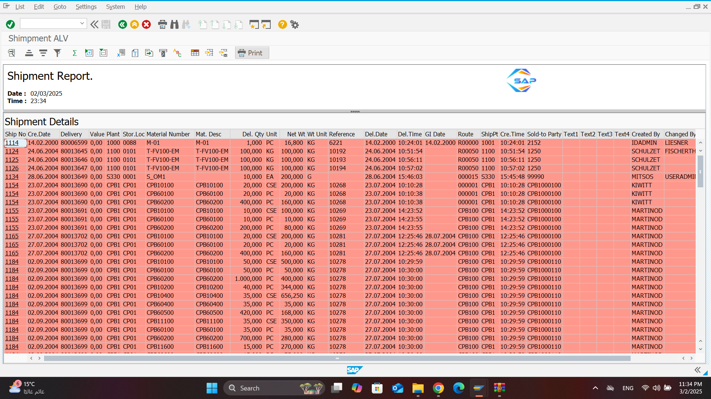

# SAP ABAP Shipment ALV Report 📦

## Overview
A comprehensive SAP ABAP shipment tracking report that integrates delivery, material, and shipping information across multiple SAP modules. The report combines data from shipment management (VTTP/VTTK), delivery processing (LIPS/LIKP), and billing (VBRK) to provide a complete view of shipment operations.

### Data Integration
- **Shipment Data (VTTP/VTTK)**
- **Delivery Details (LIPS/LIKP)**
- **Billing Information (VBRK)**

### Key Features
- Multi-table data integration with optimized joins
- Comprehensive filtering options:
  - Delivery Numbers
  - Plants
  - Creation Dates
- Detailed material and shipping information
- Complete tracking of document flow
- User and time stamp tracking
- Carrier and route monitoring

### Business Benefits
- End-to-end shipment visibility
- Integrated delivery tracking
- Material movement monitoring
- Financial value tracking
- Complete audit trail
- Operational efficiency insights

### Presentation Layer
- ALV Grid display
- Interactive user interface
- Custom field catalog
- Layout variants

# Screen Documentation

## 1. Selection Screen

  <em>Main selection screen featuring delivery filtering, plant selection, creation date range, and field catalog configuration options</em>
   
  

## 2. Validation Rules

### Status Selection Validation

  <em>Validation preventing simultaneous selection of 'All' with specific status options (Old/Temporary/New)</em>
   
  

### Date Range Validation

  <em>Creation date (ERDAT) validation preventing future date selection</em>
   
  

### Delivery Number Validation

  <em>Delivery number (VBELN) range validation ensuring lower limit doesn't exceed upper limit</em>
   
  

## 3. ALV Output Display

  <em>ALV Grid display showing shipment details with color-coding based on status</em>
   
  

  <em>Different color schemes and groupings based on shipment criteria</em>
   
  
   
  

## 4. Additional Features

### Print Functionality

  <em>Print preview and options accessed via toolbar print icon</em>
   
  

### Layout Management

  <em>Layout selection between user-specific and default system layouts</em>
   
  

### Navigation Feature

  <em>Direct navigation to ZSHIPMENT_DEMO transaction via shipment number (TKNUM) hotspot</em>
   
  

### Status Filtering

  <em>Filtered view when 'New' status is selected, showing only relevant records</em>
   
  

## Technical Features
- Interactive ALV Grid
- Color-coding based on status
- Hotspot navigation
- Multiple layout options
- Print functionality
- Status-based filtering
- Comprehensive validation rules
- Direct transaction navigation

## New Feature: Adobe Form Integration

### Printing Functionality
The system now supports printing shipment reports using Adobe Forms with the following features:

#### How to Print
1. **Access Print Function**
   - Click the print button in the toolbar
   - Alternatively, use the keyboard shortcut `SHIFT + F1`

# Screen Documentation for PDF Abdobe Form  

### Print Action

  <em>Click to print button into the toolbar or press SHIFT+F1</em>
   
  

### Output Device and Print Preview

  <em>Choose LP01 as output device and click on print preview</em>
   
  

### Popup to open or save PDF on the desktop

  <em>Choose open PDF or save it on the desktop.</em>
   
  

## Shipment Report PDF Preview

## PDF
 
